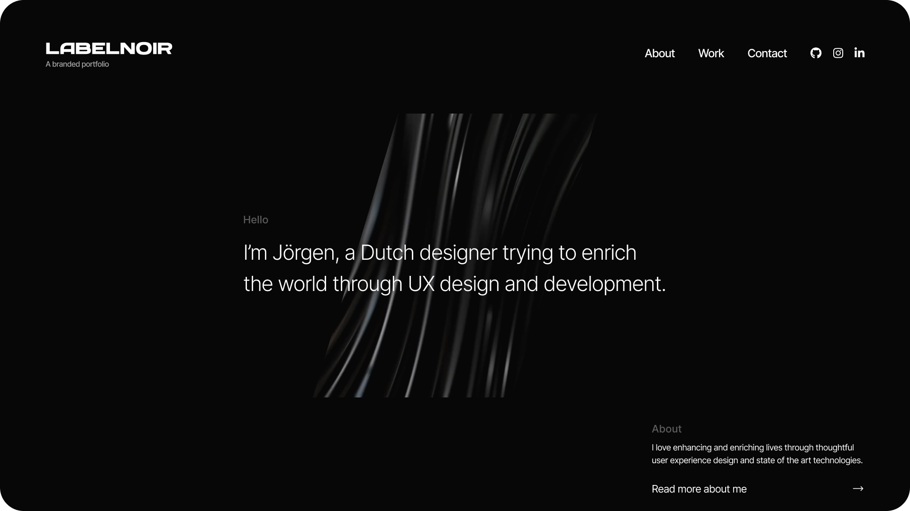

<h1 style="border:none">Labelnoir.me</h1>

## Getting Started

#### Installation

Clone the repo by running `git@github.com:JorgenKrieger/labelnoir.me.git` in your terminal.  Once downloaded, install all the packages with `pnpm i`.

#### Development

First, run the development server: `pnpm dev`

Open [http://localhost:3000](http://localhost:3000) with your browser to see the result.
